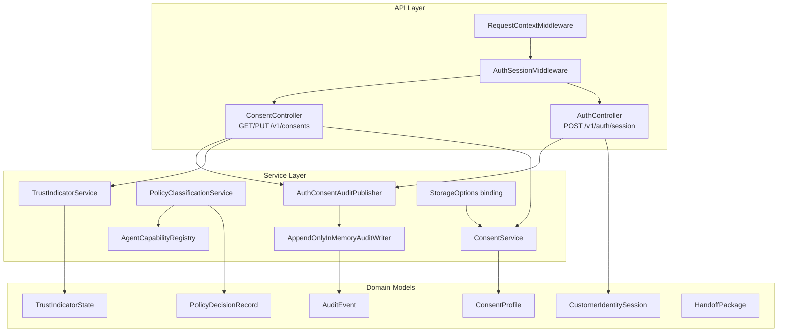

# Backend Architecture Diagram

## Purpose

This view documents how backend requests are processed from middleware through controllers
to domain services and audit outputs.

## Request Lifecycle Walkthrough

1. `RequestContextMiddleware` assigns or propagates correlation IDs and handles top-level errors.
2. `AuthSessionMiddleware` extracts lightweight session context from request headers.
3. Controllers route requests to domain services:
  - `AuthController` creates session payloads and triggers sign-in audit events.
  - `ConsentController` reads and updates consent and computes trust indicator state.
4. `ConsentService` enforces consent semantics including revocation enforcement windows.
5. `TrustIndicatorService` projects user-facing trust/read-only state from consent profile data.
6. `AuthConsentAuditPublisher` writes append-only events through `IAuditWriter`.

## Design Principles Applied

- Read-only baseline enforced across policy and capability definitions.
- Correlation-first observability for every meaningful interaction.
- Clear separation of transport models, domain models, and service behavior.
- Controller endpoints remain thin; business logic lives in services.

