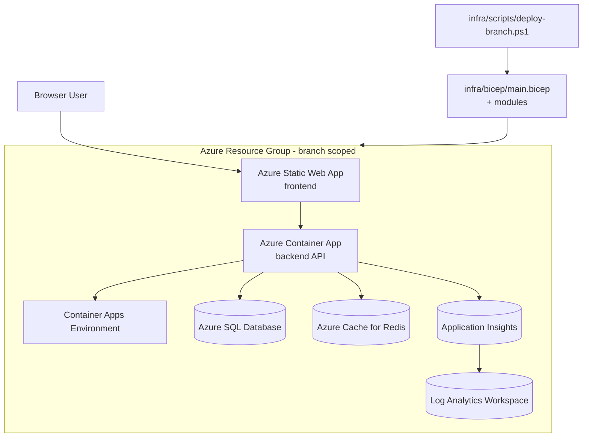

# Deployment Topology Diagram

## Purpose

This diagram explains how branch-scoped environments are provisioned in Azure and how
traffic flows between runtime services.

## Deployment Walkthrough

1. The deployment script [infra/scripts/deploy-branch.ps1](../infra/scripts/deploy-branch.ps1)
  loads environment-specific values from [infra/env/dev.json](../infra/env/dev.json) or
  [infra/env/test.json](../infra/env/test.json).
2. The script invokes [infra/bicep/main.bicep](../infra/bicep/main.bicep), which composes
  backend, frontend, data, and observability modules.
3. Azure resources are tagged with branch and environment metadata for traceability.
4. The frontend is hosted in Azure Static Web Apps and calls the backend API hosted on
  Azure Container Apps.
5. Backend APIs use SQL/Redis and emit telemetry to Application Insights and Log Analytics.

## Runtime Notes

- This topology is designed for non-production branch validation.
- The module layout supports independent scaling and replacement of each tier.
- Observability is first-class so policy, consent, and trust flows can be audited.

