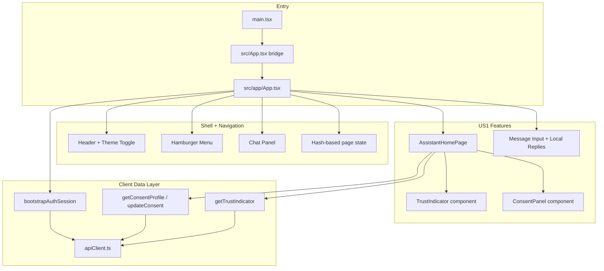

# Frontend Architecture Diagram

## Purpose

This view shows how the React app shell coordinates navigation, conversation UX, and
US1 trust/consent features.

## UI Walkthrough

1. `main.tsx` mounts the app through a compatibility bridge (`src/App.tsx`) to `src/app/App.tsx`.
2. The app shell initializes theme, hash-based navigation, and session bootstrap.
3. Chat UI manages local message interaction while trust/consent state is fetched from APIs.
4. `AssistantHomePage` orchestrates:
  - `TrustIndicator` for current user trust posture
  - `ConsentPanel` for scope-level consent actions
5. `apiClient.ts` centralizes HTTP behavior, request headers, and fallback behavior for local UX.

## Frontend Responsibility Boundaries

- App shell: global chrome and session bootstrap.
- Page layer: feature-specific orchestration and data refresh logic.
- Component layer: focused rendering for trust and consent concerns.
- Service layer: API protocol details isolated from component code.

