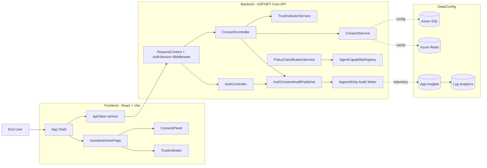

# Solution Context Diagram

## Purpose

This diagram describes the complete Phase 0 trust foundation boundary: browser user,
React frontend, ASP.NET Core backend, and Azure-hosted data/observability services.

## How the System Works

1. The user interacts with a conversational-first frontend shell.
2. Frontend components call the backend through a centralized API client.
3. Backend middleware establishes request context and session state.
4. Controllers coordinate consent, trust indicators, and audit publishing.
5. Service-layer components enforce read-only policy and produce auditable outputs.
6. Data and telemetry services support operational visibility and future scale.

## Responsibilities by Layer

- Frontend: interaction flow, consent controls, trust visibility, and local chat UX state.
- Backend API: authenticated request orchestration and business rule enforcement.
- Service layer: consent lifecycle, trust-state projection, policy evaluation, and audit writes.
- Platform services: SQL/Redis for persistence and App Insights/Log Analytics for observability.

