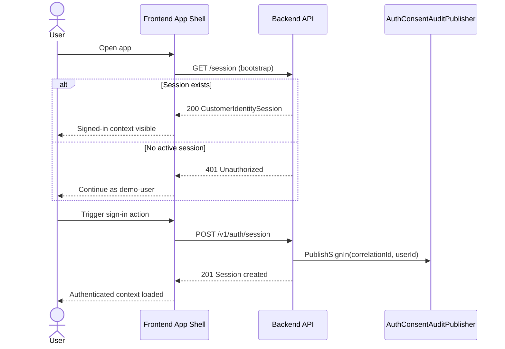
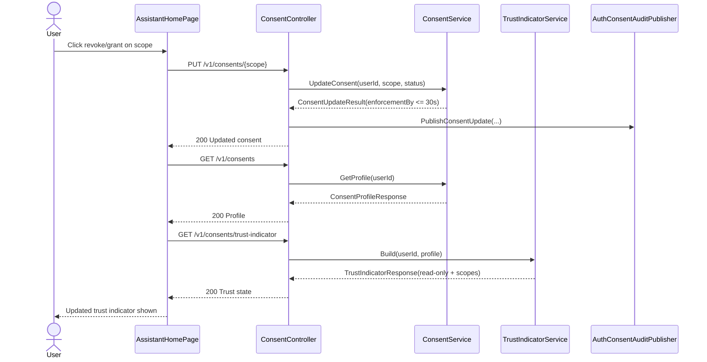
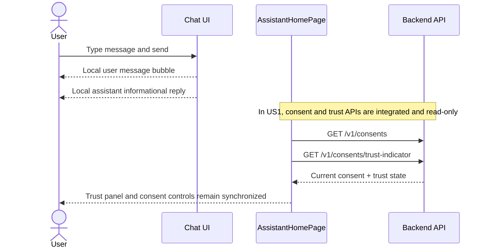

# User Interaction Diagrams

## Purpose

These sequence diagrams provide behavior-level traces for the primary user paths already
implemented in Phase 0 and US1.

## How to Read These Flows

- Each diagram starts at user intent and follows downstream system calls.
- Arrows to backend participants represent API requests; reverse arrows represent API responses.
- Audit and trust-related participants show where compliance and safety controls are applied.

## Operational Expectations

1. Session bootstrap can tolerate missing server session and continue in demo mode.
2. Consent updates must produce enforceable results within the 30-second requirement window.
3. Trust indicator refresh should immediately reflect current consent posture.
4. Conversation UX remains read-only in this phase and does not execute state-changing actions.

## 1) Sign-in Session Bootstrap

## 2) Consent Update and Trust Indicator Refresh

## 3) Conversational Interaction (Read-only)

